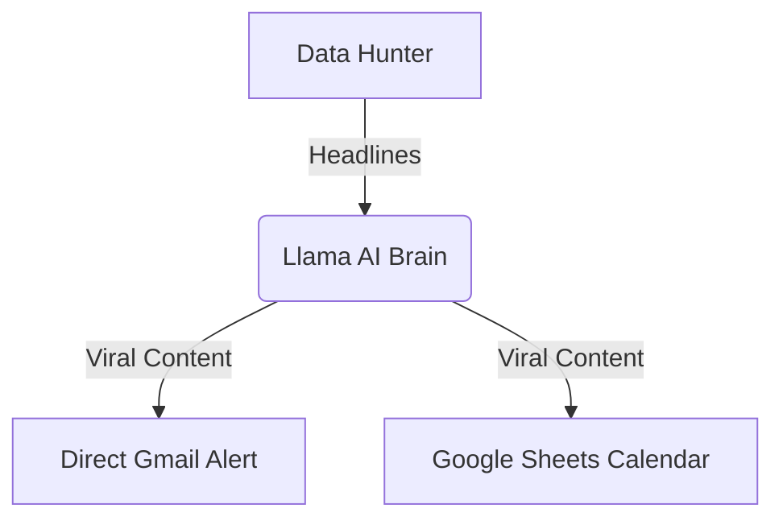

# 🏥 AI Health News Agency: The "Zero-Cost" Autonomous Engine
### *Transforming Global Health News into Viral TikTok Content via Local AI Orchestration.*
---
## 🚀 The Mission
This project solves a major bottleneck for Digital Marketing Agencies: **The Content Vacuum.** This system autonomously hunts for high-impact health news and generates a complete viral social media bundle—**at $0 monthly cost to the business.**
## 💎 The Three Innovation Pillars
### 1. Zero-Cost Brain (Local Llama 3.2)
Unlike traditional solutions that rely on expensive OpenAI or Gemini API calls, this system uses **Llama 3.2** running locally via **Ollama**.
*   **Result**: 100% Privacy, $0 API Fees, Unlimited Processing.
### 2. Pure Python Orchestration (No Middlemen)
Most "no-code" builders rely on Make.com or Zapier, which charge high subscription fees. This engine uses **Pure Python** to talk directly to:
*   **Gmail API**: For instant viral alerts.
*   **Google Sheets API**: For a persistent Content Calendar database.
### 3. Data-Driven Research
Powered by the **NewsAPI**, the system scans 80,000+ global sources to find only the most trending, medical-grade headlines for transformation.
---
## 🏗️ System Architecture

**🛠️ Tech Stack**
Language: Python 3.x
AI Model: Meta Llama 3.2 (Local)
APIs: NewsAPI, Google Sheets API v4
Libraries: ollama, gspread, smtplib, requests
**📈 Business Impact**
Time Saved: 10+ hours/week of manual research.
Cost Saved: $500+/year in subscriptions.
Velocity: Instant turnaround for trending news.
Designed & Built by Ammar
Ready to automate your business? Let's connect.
